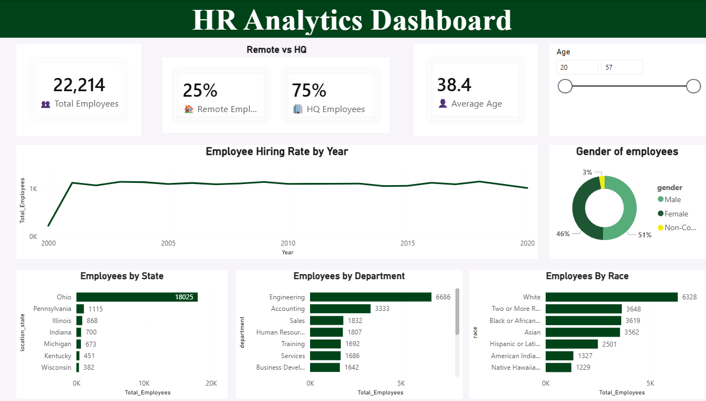

# HR-Analytics-PowerBI
HR Analytics Dashboard developed using Power BI to analyze workforce demographics, hiring trends, employee distribution, and workforce metrics.
# HR Analytics Dashboard

## Project Overview

This project analyzes employee and workforce data using Power BI.
The dashboard provides insights into employee demographics,
workforce distribution, hiring trends, and key HR metrics.

## Tools Used

- Power BI
- Excel
- Data Analysis
- Data Visualization

## Key KPIs

- Total Employees
- Remote Employee Percentage
- HQ Employee Percentage
- Average Employee Age

## Dashboard Analysis

The dashboard analyzes:

- Hiring trends by year
- Gender distribution
- Employee distribution by state
- Department-wise workforce
- Race distribution
- Remote vs HQ employees

## Key Insights

- Ohio had the highest workforce concentration.
- Engineering had the largest workforce.
- Remote and HQ workforce distribution was analyzed.
- Hiring trends were analyzed by year.

## Dashboard Screenshots

### HR Dashboard

